<div align="center">
  <picture>
    <source media="(prefers-color-scheme: light)" srcset="./assets/nucleus-hero-light.svg" />
    <source media="(prefers-color-scheme: dark)" srcset="./assets/nucleus-hero-dark.svg" />
    
  </picture>
</div>

<div align="center">
  <a href="https://github.com/nucleuskit/nucleus">
    
  </a>
  <a href="https://github.com/nucleuskit/contract">
    
  </a>
  <a href="https://github.com/nucleuskit?tab=repositories">
    
  </a>
</div>

<div align="center">
  <a href="https://github.com/nucleuskit">
    
  </a>
</div>

<br />

<div align="center">
  
</div>

<br />

<details open>
  <summary><b>01 / Start the kernel</b></summary>

```txt
contract -> generator -> service edge -> runtime module
```

Nucleuskit is a compact Go toolkit for building backend systems from explicit
contracts. The point is not to hide the architecture. The point is to make the
service boundary obvious, generated code predictable, and verification close to
the edge where systems actually break.

<p>
  <a href="https://github.com/nucleuskit/nucleus">
    
  </a>
  <a href="https://github.com/nucleuskit/nucleus/stargazers">
    
  </a>
</p>
</details>

<details>
  <summary><b>02 / Flip the module deck</b></summary>

| Surface | Repository | Signal |
| --- | --- | --- |
| kernel | [nucleus](https://github.com/nucleuskit/nucleus) | coordinates generation, evolution, verification |
| contract | [contract](https://github.com/nucleuskit/contract) | keeps service intent explicit |
| core | [core](https://github.com/nucleuskit/core) | holds runtime primitives |
| http | [http](https://github.com/nucleuskit/http) | maps contracts to HTTP edges |
| grpc | [grpc](https://github.com/nucleuskit/grpc) | maps contracts to gRPC edges |
| worker | [worker](https://github.com/nucleuskit/worker) | runs async/background service work |

</details>

<details>
  <summary><b>03 / Inspect the design rule</b></summary>

```txt
If the contract changes, the generated surface should make the blast radius visible.
```

- Prefer explicit service boundaries over clever glue.
- Keep generated code readable enough to debug without ceremony.
- Let modules stay small, named, and replaceable.
- Put verification near the contract, not at the end of the story.

</details>
