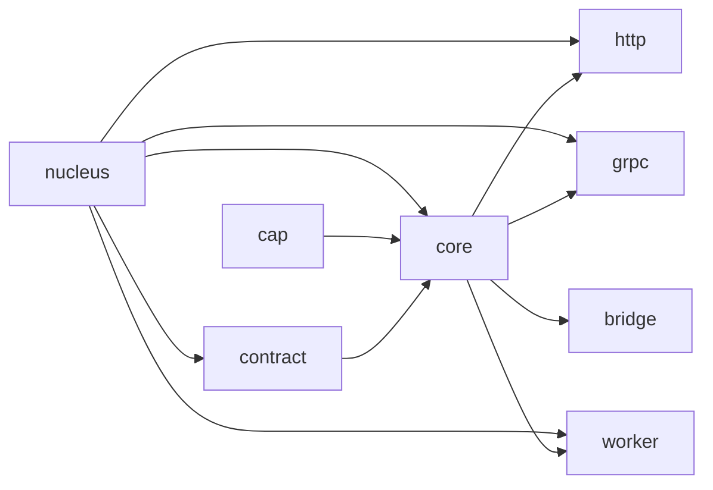
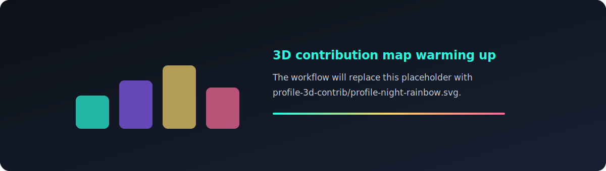

  <picture>
    <source media="(prefers-color-scheme: light)" srcset="./assets/nucleus-hero-light.svg" />
    <source media="(prefers-color-scheme: dark)" srcset="./assets/nucleus-hero-dark.svg" />
    
  </picture>

  
  
  

  

 

<table>
  <tr>
    <td width="58%">
      <h3>Nucleuskit builds backend systems from contracts.</h3>
      

        A compact Go toolkit for turning service contracts into generated, verifiable,
        evolvable microservice building blocks.
      

      

        The focus is simple: keep the service boundary explicit, make generated code
        predictable, and leave enough room for real production systems to grow.
      

    </td>
    <td width="42%">
      
    </td>
  </tr>
</table>

## Control Plane

  
<b>System map</b>

  
<b>Module deck</b>

| Module | Role | Repository |
| --- | --- | --- |
| nucleus | AI-first Go microservice kernel | [nucleuskit/nucleus](https://github.com/nucleuskit/nucleus) |
| contract | Contract model and shared surface | [nucleuskit/contract](https://github.com/nucleuskit/contract) |
| core | Service runtime primitives | [nucleuskit/core](https://github.com/nucleuskit/core) |
| http | HTTP integration module | [nucleuskit/http](https://github.com/nucleuskit/http) |
| grpc | gRPC integration module | [nucleuskit/grpc](https://github.com/nucleuskit/grpc) |
| worker | Worker execution module | [nucleuskit/worker](https://github.com/nucleuskit/worker) |
| bridge | Adapter bridge module | [nucleuskit/bridge](https://github.com/nucleuskit/bridge) |
| cap | Capability module | [nucleuskit/cap](https://github.com/nucleuskit/cap) |

  
<b>Operating principles</b>

- Contracts before glue code.
- Generated code should be readable, replaceable, and boring in the best way.
- Runtime modules stay small enough to understand in one sitting.
- Verification belongs near the service boundary, not as an afterthought.
- AI can help generate systems, but contracts keep the system honest.

## Featured Repositories

  
  

  
  

## Runtime Surface

  
  
  
  
  
  

 

  
  

## Activity Stream

  

  

  <picture>
    <source media="(prefers-color-scheme: dark)" srcset="https://raw.githubusercontent.com/nucleuskit/nucleuskit/output/github-snake-dark.svg" />
    <source media="(prefers-color-scheme: light)" srcset="https://raw.githubusercontent.com/nucleuskit/nucleuskit/output/github-snake.svg" />
    
  </picture>

  

## Launch Links

  
  
  

 

  

